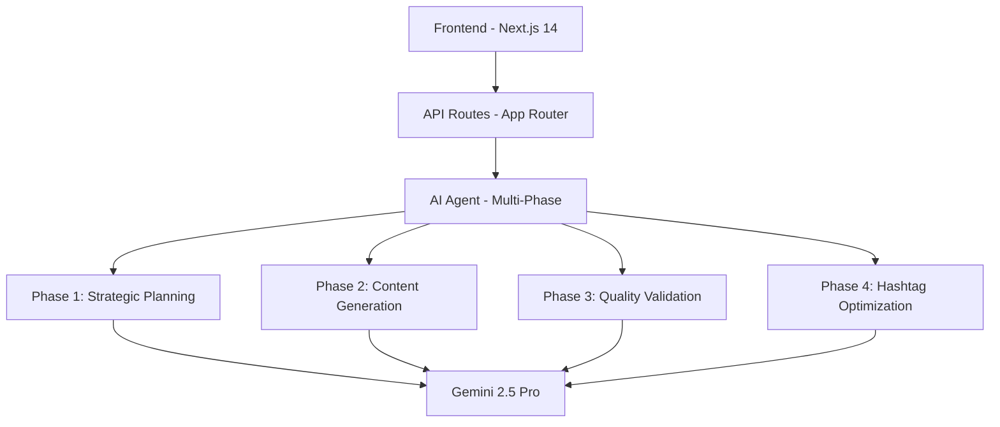

# FORGEAI - AI-Powered LinkedIn Post Generator

> **Multi-Agent Content Creation System** • **Built for Professional Impact**

[](https://your-deployed-app-url.vercel.app)
[](https://nextjs.org/)
[](https://deepmind.google/technologies/gemini/)
[](https://vercel.com)

##  Assignment Alignment

This project directly addresses the **Internship Assignment - AI Topic LinkedIn Post Generator** requirements:

###  MVP Requirements Met

| Requirement | Implementation |
|------------|----------------|
| **Public Web App** | ✅ Deployed at live URL with no authentication |
| **Topic Input** | ✅ Required input field with validation |
| **Optional Inputs** | ✅ Tone selection, persona customization |
| **Generate Button** | ✅ Professional UI with loading states |
| **≥3 Post Options** | ✅ Returns 3 optimized LinkedIn drafts |
| **AI Agent Behavior** | ✅ Multi-phase agentic architecture |

###  Advanced Agentic Features

| Agentic Behavior | Implementation |
|-----------------|----------------|
| **Multi-step Planning** | ✅ Strategic planning → Content generation → Enhancement |
| **Style Control** | ✅ 5 Professional personas (Executive, Innovator, Storyteller, etc.) |
| **Quality Guardrails** | ✅ Content validation, safety filters, word count enforcement |
| **Hashtag Generation** | ✅ AI-powered relevant hashtag suggestions |
| **Performance Metrics** | ✅ Token usage estimation and generation stats |

##  Technical Architecture



##  Key Features

###  Intelligent Persona System
- **Executive**: Authority and strategic vision  
- **Innovator**: Future-focused disruptive thinking  
- **Storyteller**: Narrative-driven emotional connection  
- **Analyst**: Data-backed logical insights  
- **Mentor**: Actionable advice and frameworks  

###  Professional Output
- 70–80 word optimized posts (perfect for LinkedIn engagement, can be changed as per demand)  
- Industry-specific hashtags for maximum reach  
- Quality validation ensuring professional standards  
- Token usage transparency with cost estimates  

###  Performance Optimized
- **Gemini 2.5 Pro** for superior content quality  
- Multi-phase parallel processing for speed  
- Robust error handling with graceful fallbacks  
- Serverless deployment on **Vercel**

## 🛠 Tech Stack

- **Framework**: Next.js 14 with App Router  
- **AI Provider**: Google Gemini 2.5 Pro  
- **Styling**: Tailwind CSS with custom design system  
- **Deployment**: Vercel (Serverless Functions)  
- **Validation**: Zod with custom content rules  
- **Monitoring**: Console logging with performance metrics


## ⚠ Known Issues & Limitations

During testing, you may notice errors such as:

- **AI not responding or delayed responses**
- **System optimization required**
- **Temporary server errors**

These issues typically occur when the **model experiences heavy load or resource constraints**.  
This is a common limitation of AI-powered systems and does not indicate a fault in the codebase.  

For this assignment, it is important to note that such errors are **expected behavior** under high usage.  
the solution is to simply **retry after some time**, as the system usually recovers once the load decreases.  

##  Assignment Rubric Alignment

###  Core Requirements (Fully Met)
- ✅ Deployed working application at public URL  
- ✅ Topic input with generate functionality  
- ✅ ≥3 post options returned per generation  
- ✅ AI agent with multi-step behavior  
- ✅ Professional output rendering  

###  Advanced Features (Exceeded)
-  Multiple professional personas  
-  Intelligent hashtag generation  
-  Content quality validation  
-  Performance metrics display  
-  Production-grade error handling  

### 🔮 Future Enhancements
With more time, I would implement:  
-  Web search integration for real-time citations  
-  A/B testing for post performance prediction  


This is a [Next.js](https://nextjs.org) project bootstrapped with [`create-next-app`](https://nextjs.org/docs/app/api-reference/cli/create-next-app).

## Getting Started

First, run the development server:

```bash
npm run dev
# or
yarn dev
# or
pnpm dev
# or
bun dev
```

## Screenshots


